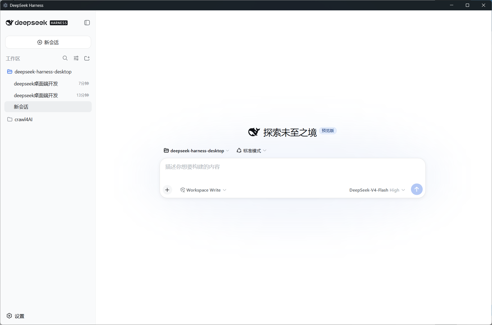

# DeepSeek Harness Desktop

> [English](README.en.md) · 中文

把 DeepSeek Harness 装进一个原生桌面窗口：**双击即可启动**，窗口里跑的是你当前 `dsh web` profile 的真实界面 —— agent 会话、工具、plan、goal、subagent、workflow……全部功能天然可用，无需二次实现。

> Everything is a plugin —— 这个仓库就是那个"窗口"。



## 特性

- 🖱️ **一键启动**：桌面快捷方式或安装目录启动入口，双击即出窗口（默认白色浅色风格，可切换深色 Codex 皮肤）
- 🪟 原生 Electron 窗口，加载 `http://127.0.0.1:<port>` 的实时 UI
- ⌨️ Web UI 里输入 `/desktop` 打开/复用窗口（同一后端只开一个）
- 🔗 外部链接走系统浏览器
- 🛑 **关窗即退出后端**（安装版）；不设置 `DSH_DESKTOP_LAUNCH` 时保持浏览器优先
- 🚀 **启动闪屏**：点图标立刻弹出鲸鱼进度窗口（初始化后端 / 加载界面），主窗口就绪自动交接
- 🐋 全程使用官方 DeepSeek 鲸鱼图标（窗口、任务栏、快捷方式、安装器）

## 怎么用

### 方式一：git clone 安装（推荐，紧跟最新代码）

在命令行里依次运行（需 Node.js ≥ 22.19，**必须**；git 需已安装；建议克隆到无空格的路径）：

```bat
git clone https://github.com/Muelsysel/DeepSeek-Harness-Desktop.git
cd DeepSeek-Harness-Desktop
start.cmd
```

`start.cmd` 自动完成：首次构建（`npm install` + `npm run build`）→ 检查 Node.js → 检查 DeepSeek Harness → **注册插件**（装进 `$DSH_HOME\profiles\web`）→ **自动创建桌面快捷方式**（鲸鱼图标）→ 启动窗口。无需修改任何文件。窗口打开即用，以后双击桌面「**DeepSeek Harness 桌面版**」图标即可（或 `bin\dsh-desktop.cmd` / Web UI 里 `/desktop`）。

> 之后想更新到最新代码：`git pull` 然后重跑 `start.cmd` 即可（注册幂等，快捷方式会刷新）。
> 也可以先手动构建再启动：`npm install && npm run build && start.cmd`。

### 方式二：zip 便携版（免安装，不需要 git）

只需三步：**下载 → 一行命令 → 使用**。

1. 到 [GitHub Releases](https://github.com/Muelsysel/DeepSeek-Harness-Desktop/releases) 下载 `DeepSeek-harness-desktop-plugin-<版本>.zip` 并解压（需 Node.js ≥ 22.19，**必须**；pnpm 无需手动安装，注册时自动装）
2. 打开命令行（任意目录），输入一行命令——把 `<解压路径>` 换成你的实际解压位置（或直接双击根目录 `start.cmd`，效果相同）：

   ```bat
   cd /d "<解压路径>" && start.cmd
   ```

   这一条命令自动完成：检查 Node.js → 检查 DeepSeek Harness → **注册插件**（装进 `$DSH_HOME\profiles\web`）→ **自动创建桌面快捷方式**（鲸鱼图标）→ 启动窗口。无需修改任何文件。
3. 窗口打开即用。以后日常使用，双击桌面「**DeepSeek Harness 桌面版**」图标即可（或 `bin\dsh-desktop.cmd` / Web UI 里 `/desktop`）。

> 已经装过？重跑这条命令也安全——注册幂等，快捷方式会刷新。换了解压位置，重跑一次即可按新位置重建快捷方式。

### 方式三：安装版 setup.exe（自带后端、免环境）

1. 到 [GitHub Releases](https://github.com/Muelsysel/DeepSeek-Harness-Desktop/releases) 下载 `DeepSeek-Harness-Desktop-Setup-<版本>.exe`
2. 双击安装（免管理员），安装完成自动启动
3. **无需安装 Node.js / pnpm / DeepSeek Harness** —— 后端和 Electron 运行时全部内置；首次启动闪屏显示初始化进度，之后秒开

安装位置：`%LOCALAPPDATA%\Programs\DeepSeek-Harness-Desktop`（无空格路径）。启动入口：桌面快捷方式（鲸鱼图标）、开始菜单、安装目录内的 `DeepSeek Harness Desktop.lnk`，任选其一。私有数据放在 `%APPDATA%\DeepSeek-Harness-Desktop`（不碰你的 `$DSH_HOME` profile），**关窗即退出**。

### 方式四：手动装进已有 dsh profile（进阶）

前置：Node.js ≥ 22.19（**必须**）、pnpm（无需手动装，注册时自动安装）。

```bat
:: 1) 安装到 web profile（注册插件 + 创建桌面快捷方式）
bin\install.cmd

:: 2) 以后每次"点击启动"（等价于 DSH_DESKTOP_LAUNCH=1 dsh web）
bin\dsh-desktop.cmd
```

`bin\install.cmd` 做了什么：

1. 用 pnpm 把本插件作为 `link:` 依赖装进 `$DSH_HOME\profiles\web`
2. 把 `dsh-desktop` 追加到 profile 的 `dsh.profile.bundles`（幂等，有备份）
3. bundle patch（`patch\desktop.bundle.yml`）插入 `desktop` 行：`autoOpen` 由 `DSH_DESKTOP_LAUNCH` 决定
4. 在桌面创建「`DeepSeek Harness 桌面版`」快捷方式（鲸鱼图标）

> 也可以跳过 install.cmd：`bin\dsh-desktop.cmd` 首次点击时会检测插件是否已注册（`install-profile.mjs --check`：0 就绪 / 1 需注册 / 2 profile 尚未创建），未注册就自动注册一次再启动（profile 不存在会自动创建最小骨架）——但桌面快捷方式仍需 `bin\install.cmd` 或 `create-shortcut.cmd` 创建。

使用方式：

| 方式 | 说明 |
|---|---|
| `cd /d "<解压路径>" && start.cmd` | **一行命令**（任意目录可运行；或直接双击根目录 `start.cmd`）：检查 Node → 检查 dsh → 注册插件 → 自动建桌面快捷方式 → 启动窗口 |
| `bin\install.cmd`（一次性） | 只注册插件 + 创建桌面快捷方式（不启动窗口） |
| 桌面「DeepSeek Harness 桌面版」快捷方式 | 双击即出窗口（免控制台） |
| 安装版 setup.exe | 自带后端：免 Node/pnpm/dsh，闪屏进度，首次初始化后秒开；桌面 / 开始菜单 / 安装目录三处启动入口 |
| `create-shortcut.cmd`（根目录） | 单独补建/重建桌面快捷方式（按实际解压位置生成正确路径） |
| `bin\dsh-desktop.cmd` | 一键启动：`dsh web` + 自动开窗（可加参数，如 `--port 3180`）；未注册时首次自动注册 |
| Web UI 里 `/desktop` | 打开/复用当前后端的桌面窗口 |
| `bin\uninstall.cmd` | 从 profile 移除插件（含 package.json 备份） |

> 不设置 `DSH_DESKTOP_LAUNCH` 时，普通 `dsh web` 保持"只用浏览器"的行为，不会弹窗。
> 端口：launcher 默认 `--port 0`（系统分配空闲端口，绝不和 3080 冲突）；设 `DSH_DESKTOP_PORT` 可固定端口，或直接加 `--port 3180`。

## 配置（插件版）

插件配置在 profile 的 patch 层覆盖（例如 `cordis.patch.yml` 里给 `desktop` 行写 config）：

| 字段 | 默认 | 说明 |
|---|---|---|
| `autoOpen` | `false` | 启动时自动开窗（launcher 通过 env 置 true） |
| `title` | `DeepSeek Harness` | 窗口标题 |
| `width` / `height` | `1280` / `800` | 初始窗口尺寸 |
| `theme` | `default` | `default` = 白色浅色风格；`codex` = 深色 Codex 皮肤 |
| `electronArgs` | `[]` | 附加传给 Electron 的 argv（如 `--no-sandbox`） |

环境变量：`DSH_DESKTOP_LAUNCH=1` 开启 auto-open；`DSH_DESKTOP_TITLE` 覆盖标题；`DSH_DESKTOP_ELECTRON` 手动指定 electron 可执行文件路径（兜底）；`DSH_DESKTOP_DEBUG=1` 写调试日志到 `%TEMP%\dsh-desktop-debug.log`。

## 从源码构建

```bat
:: 插件 zip（tsc 编译 + 离线 zip：源码 + lib + node_modules，解压即用）
npm install
npm run build
node scripts\package.mjs        :: → dist\DeepSeek-harness-desktop-plugin-<版本>.zip

:: 安装版 setup.exe（NSIS 安装器：打包自包含 app —— 内置 dsh 后端 + Electron + 闪屏，
:: 目标机器免 Node/pnpm/dsh；首次构建自动下载 NSIS 编译器到 tools\）
node scripts\make-setup.mjs     :: → dist\DeepSeek-Harness-Desktop-Setup-<版本>.exe
```

开发命令：`npm run build` / `npm run typecheck` / `npm test`（`node --test`）。

## 项目结构

```
src/           插件逻辑（Cordis 插件：/desktop 命令、自动开窗、窗口管理）
desktop/       Electron 外壳（main.cjs / preload.cjs / codex.css 皮肤 / splash.html）
patch/         插入 profile 的 bundle 行
bin/           一键启动 / 安装 / 卸载脚本 + 官方图标
apps/standalone/ 自包含桌面 app 源码（后端拥有的 main.cjs + bundled backend/，打包进 setup.exe）
scripts/       安装脚本、离线打包（package.mjs）、安装器构建（make-setup.mjs）、快捷方式（make-shortcut.ps1）
setup/         NSIS 安装器脚本（desktop-setup.nsi）
DeepSeek Harness 桌面版.lnk  根目录快捷方式（免脚本，右键可发送到桌面）
start.cmd      根目录首次引导向导（zip 版入口）
create-shortcut.cmd  根目录一键生成桌面快捷方式
tools/         本地 NSIS 编译器（gitignored，构建时自动下载）
docs/          ADR 决策记录 + 截图
```

## License

MIT
